🧰 Python Fluent Toolbox
一款基于 PySide6 & Fluent-Widgets 的现代化、模块化桌面工具箱
一个像浏览器一样管理工具的生产力平台。支持多标签页多开、插件热插拔、自定义主题色。
特性 • 安装 • 内置工具 • 开发插件 • 截图
<p align="center">


</p>
</div>

📖 简介
Python Fluent Toolbox 是一个高度可扩展的个人工具箱框架。它抛弃了传统工具箱千篇一律的列表式设计，采用了类似 Edge/Chrome 浏览器的多标签页架构。
无论你是开发者、数据分析师还是文字工作者，都可以通过编写简单的 Python 脚本，将自己的脚本转化为带有精美 UI 的原生桌面应用。

✨ 核心特性
🎨 极致 UI 体验: 采用最新的 Fluent Design 设计语言，支持浅色/深色主题自动切换，亚克力磨砂效果。

📑 浏览器式交互:
多标签页: 支持同一个工具打开多个标签页，互不干扰。
动态添加: 标签栏右侧 "+" 号一键克隆当前工具。
独立窗口: 支持右键将标签页“弹出”为独立窗口运行。

🧩 插件化架构:
核心与插件完全解耦，新增功能无需修改主程序。
独立的资源管理系统，图标、配置自动加载。

🛠️ 开发者友好:
提供标准 PluginInterface 接口。
内置 ResourceManager，图标资源随用随取，无需繁琐配置。

📸 应用截图
建议在此处放入软件的截图，例如

 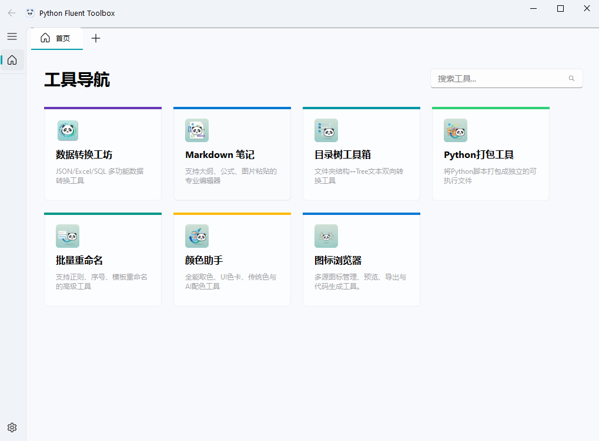

🚀 安装指南
前置要求
Python 3.12 或更高版本
步骤
克隆仓库

```
code
Bash
git clone https://gitee.com/lostsing/MyToolbox.git
cd MyToolbox
```

安装依赖

```
code
Bash
pip install -r requirements.txt
```

(注: 核心依赖包括 PySide6, PyQt-Fluent-Widgets, pandas, openpyxl, markdown, pygments)
运行程序

```
code
Bash
python main.py
```

📦 内置插件
项目内置了两个高质量的生产力工具作为示例：
0. 设置选项
支持设置浅色深色主题
自定义图片背景
插件个性化排序及隐藏
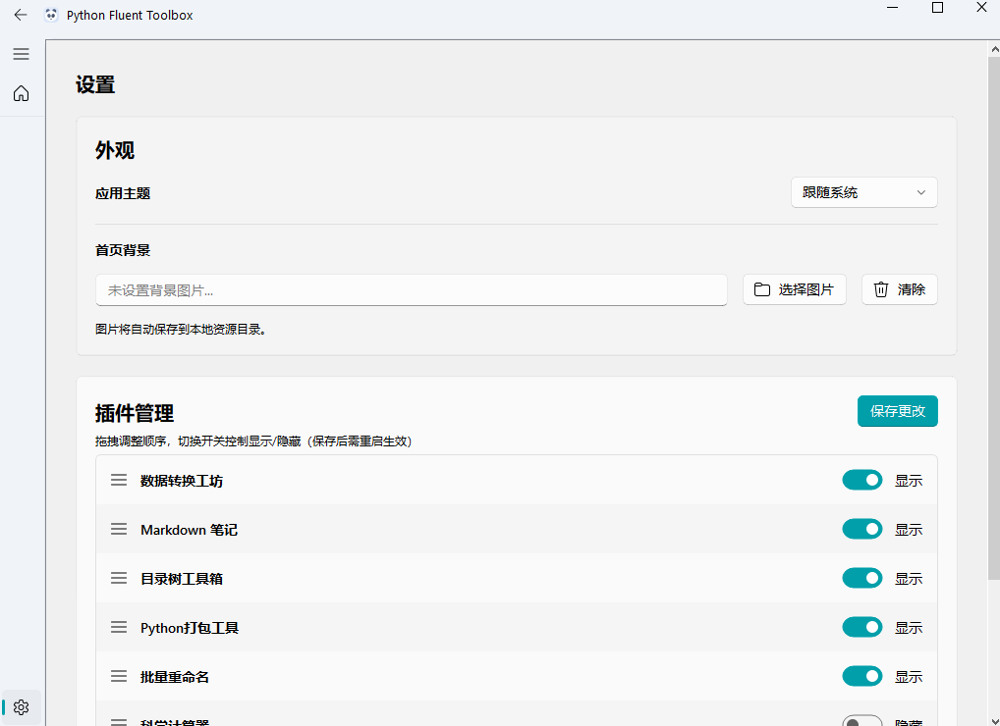
1. 📝 Markdown 笔记
一个轻量级但功能强大的 Markdown 编辑器。
双栏预览: 左侧编辑，右侧实时预览，支持同步滚动。
语法高亮: 支持代码块高亮 (Python, C++, etc.)。
文件导出: 一键将笔记导出为 PDF 或 HTML 文件。
无缝体验: 支持拖拽打开文件，自动保存上次窗口大小。
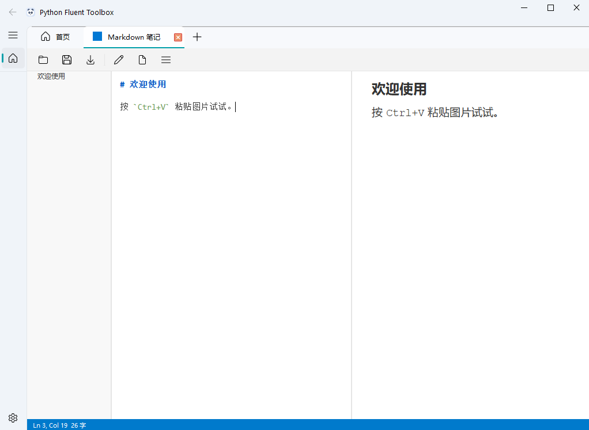
2. 🔄 数据转换工坊
专为开发者设计的数据处理瑞士军刀。
JSON 助手: 格式化、压缩 JSON，支持解析不规范的 Python 字典字符串。
Excel 工具: 一键将 Excel/CSV 文件转换为 JSON 数组。
数据库工具: Excel 导入 SQLite，或执行 SQL 查询直接导出结果。
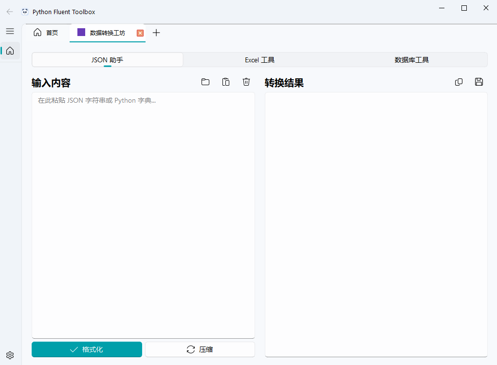
3. 📘 软件打包工具
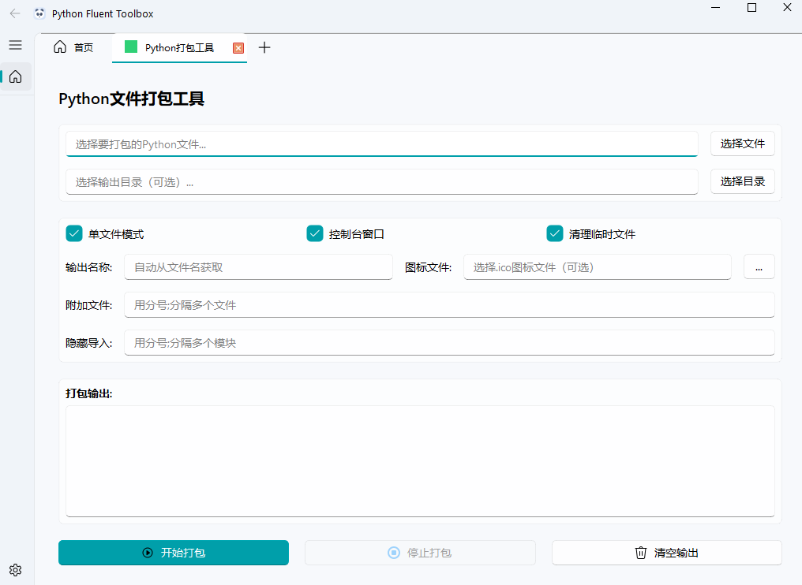
4. 🎨 颜色助手
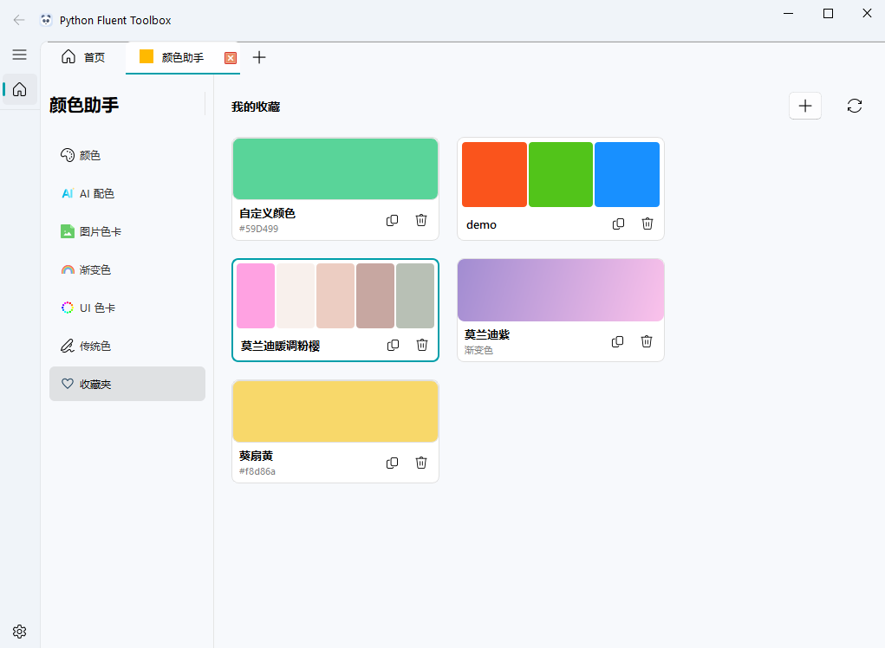

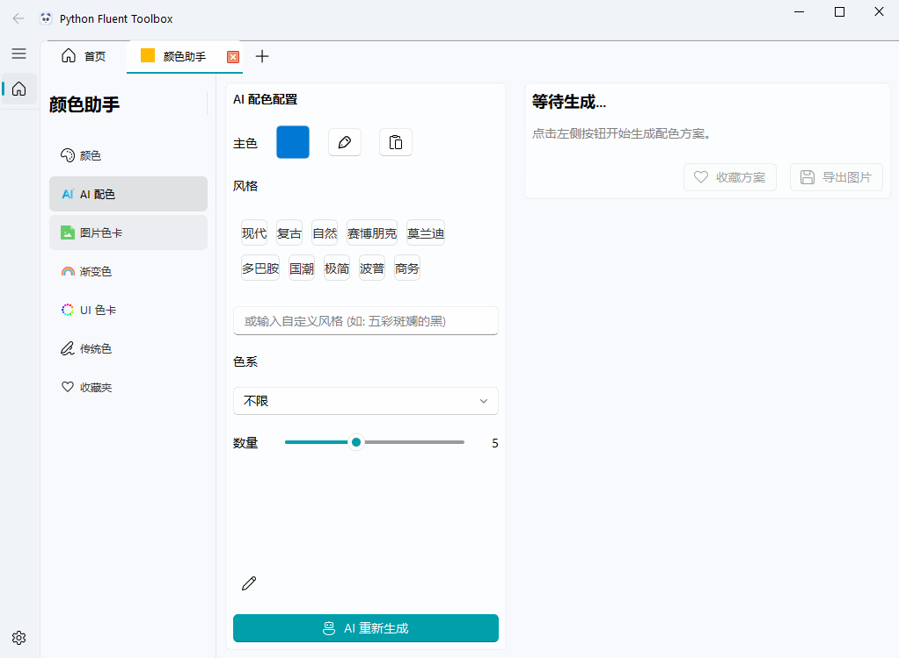

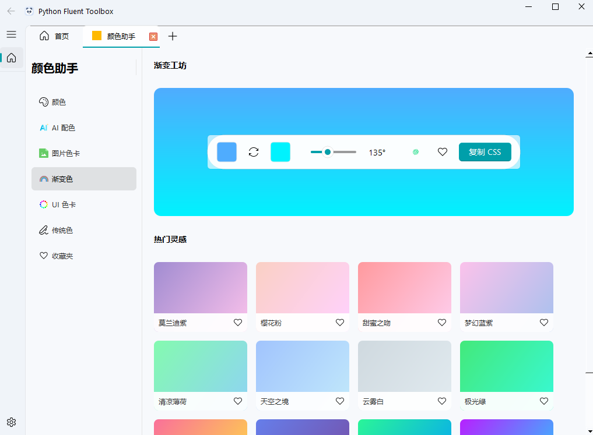
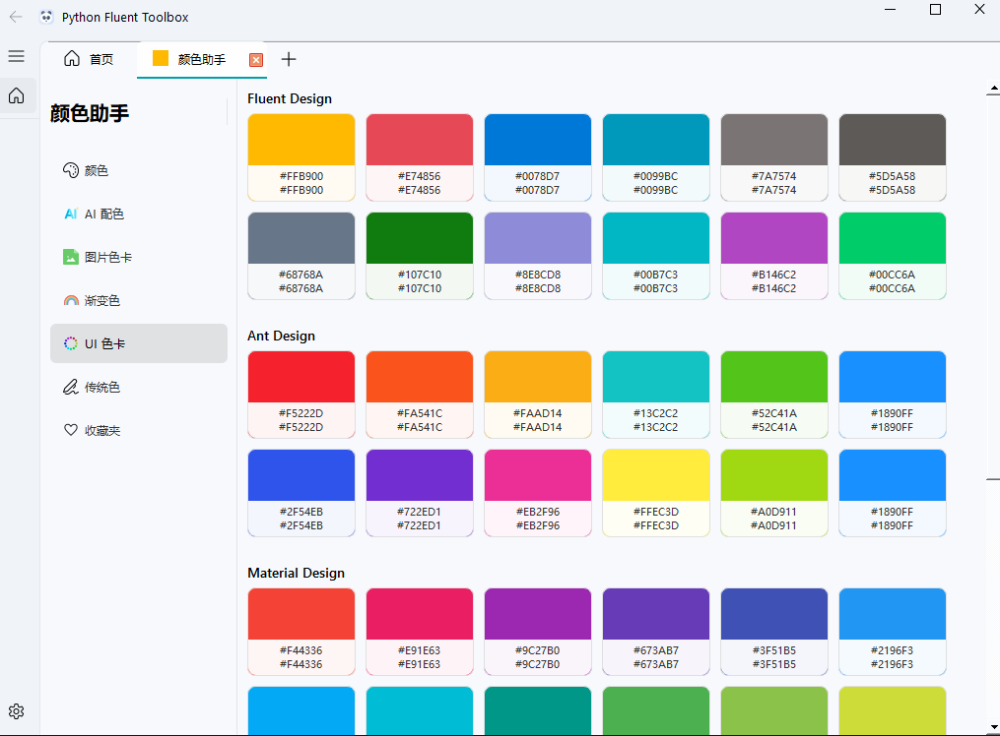
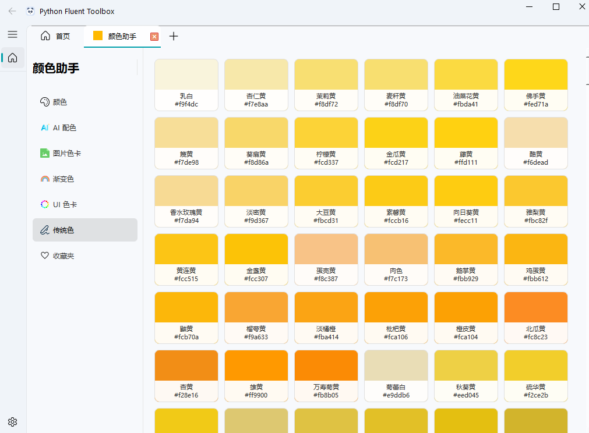
5. 📖 批量重命名
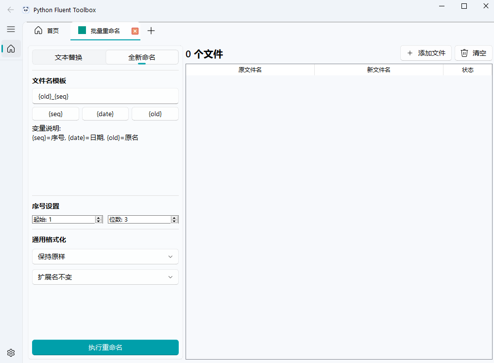
6. 目录树工具
一键将目录树文本转换为文件架构。

一键将文件夹架构转换为目录树文本。

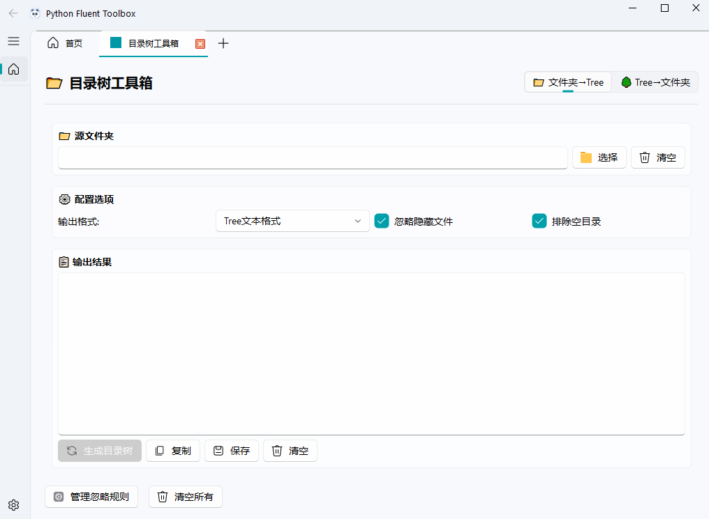
7. 图标浏览器
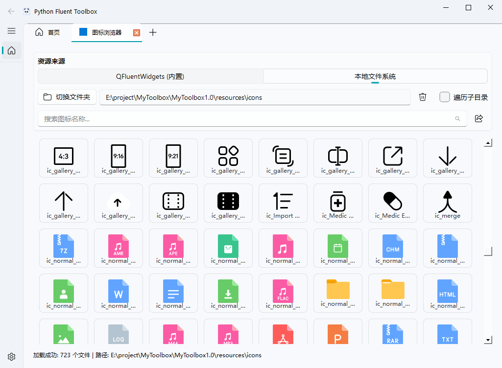


🔌 插件开发
想要添加自己的工具？非常简单！只需 3 步即可集成一个新插件。
详细文档请阅读 开发人员指南 (DEVELOPER_GUIDE.md)。
快速概览：
在 plugins/ 下新建文件夹。
继承 PluginInterface 类。
实现 create_widget 方法返回你的界面。

```
code
Python
# 示例：plugins/my_tool/tool.py
from core.plugin_interface import PluginInterface
from PySide6.QtWidgets import QLabel

class MyPlugin(PluginInterface):
    @property
    def name(self): return "我的新工具"
    @property
    def icon(self): return "rocket" # 自动读取 resources/icons/rocket.svg
    
    def create_widget(self):
        return QLabel("Hello World!")
```

📂 项目结构

```
code
Text
MyToolbox/
├── main.py                  # 程序入口
├── core/                    # 核心框架
│   ├── config.py            # 配置管理
│   ├── plugin_interface.py  # 插件接口定义
│   └── resource_manager.py  # 图标资源管理
├── ui/                      # 界面逻辑
│   ├── main_window.py       # 主窗口
│   └── views.py             # 视图与标签页逻辑
├── resources/               # 静态资源
│   └── icons/               # 图标存放处 (.svg/.png)
├── plugins/                 # 插件目录
│   ├── markdown_editor/     # [内置] Markdown 插件
│   └── demo_tool/           # [内置] 数据转换插件
└── config/                  # 用户配置文件 (自动生成)
```

🤝 贡献

欢迎提交 Pull Request 或 Issue！
如果你发现 Bug，请提交 Issue。
如果你开发了好用的新插件，欢迎提交 PR 合并到主仓库。

📄 许可证
本项目采用 MIT 许可证。

🙏 致谢

UI 框架基于 PyQt-Fluent-Widgets

图标资源来自 Fluent System Icons

<div align="center">
Created with ❤️ by YourTeam
</div>